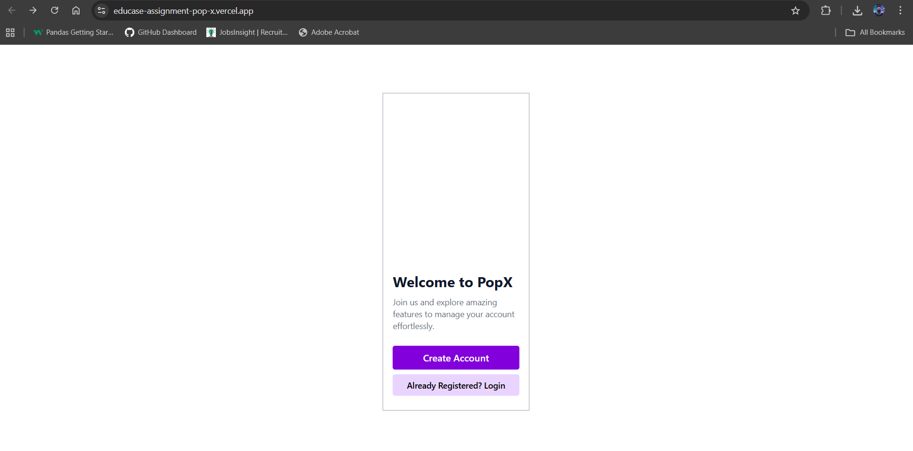
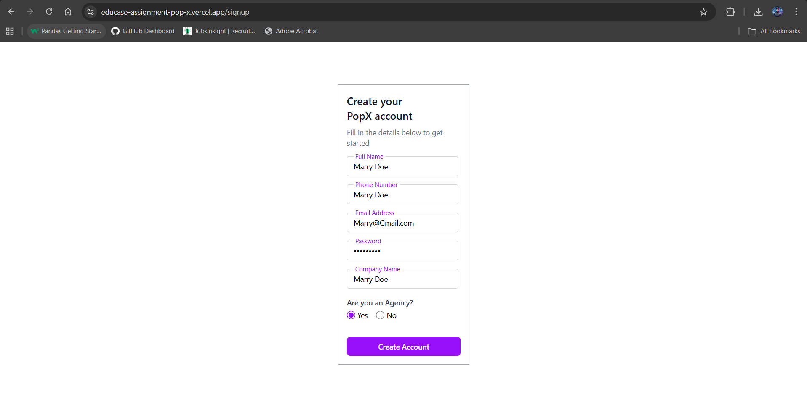
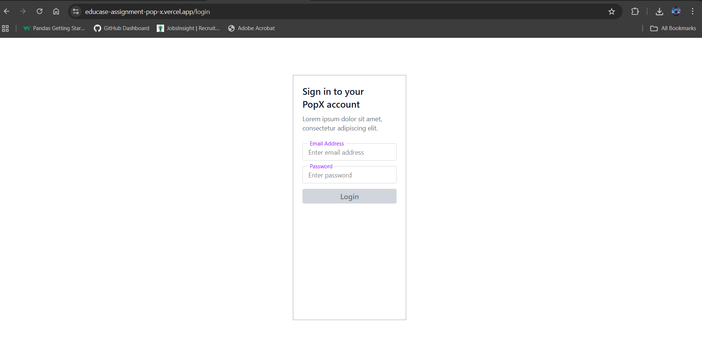
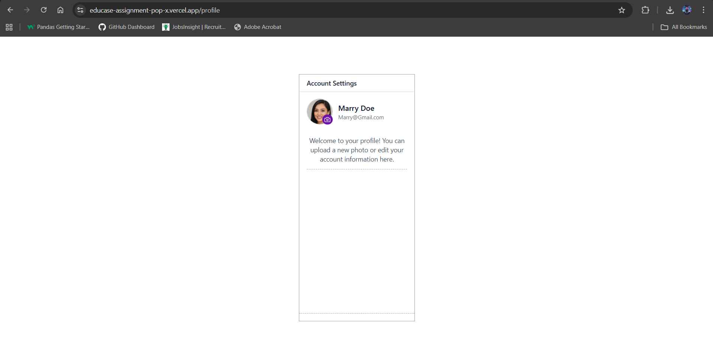

# Educase Assignment - PopX

This is a simple React-based web application built as part of an assignment. It includes a landing page, login and signup pages, and a profile page with editable user information and profile picture upload functionality. The app is designed to be responsive and pixel-perfect for mobile screens.

## Features

- Landing page with navigation to signup and login.
- Signup page with pre-filled default values and agency selection.
- Login page with form validation.
- Profile page showing user details and ability to upload a profile picture.
- Fully responsive and mobile-friendly design.

## Screenshots

### Landing Page


### Signup Page


### Login Page


### Profile Page


## Installation

1. Clone the repository:
```bash
git clone https://github.com/Vikass19/Educase_Assignment_PopX.git
